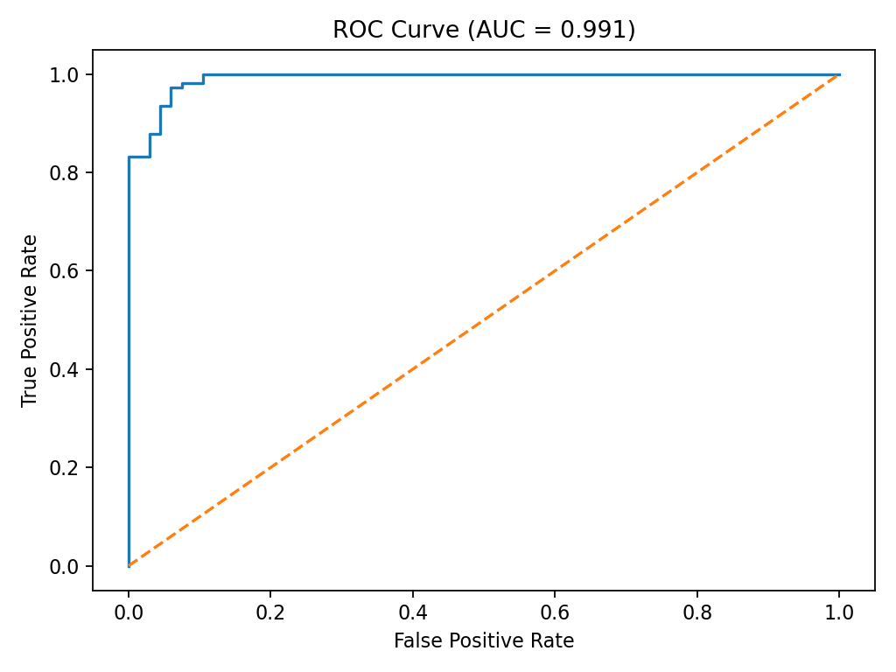
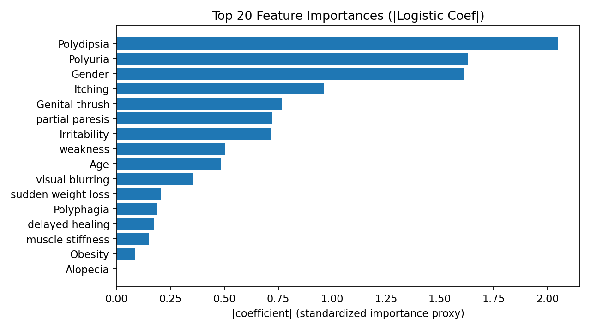

# Binary Classification ML Pipeline

## Overview

A modular, reproducible binary classification pipeline built using scikit-learn.

This project demonstrates:

- Cross-validated hyperparameter tuning  
- Regularized vs unregularized model comparison  
- Threshold optimization (Youden’s J statistic)  
- Feature importance analysis  
- Structured artifact generation  
- Config-driven experimentation  

The goal is to show how to build a clean, extensible ML workflow suitable for production-style experimentation.

---

```
## Project Structure

binary-classification-ml-pipeline/
│
├── main.py
├── requirements.txt
│
├── src/
│ ├── config.py
│ ├── data.py
│ ├── screening.py
│ ├── train.py
│ └── evaluate.py
│
└── reports/
├── lasso/
└── baseline/

```

---

## Models Implemented

### 1. L1-Regularized Logistic Regression (LASSO)

- Hyperparameter tuning via GridSearchCV  
- Cross-validation using stratified folds  
- Feature selection via L1 regularization  
- Threshold selected via Youden’s J statistic  

### 2. Baseline Logistic Regression (No Regularization)

- Same preprocessing pipeline  
- Same threshold optimization  
- Used for comparison against L1 model  

---

## Results (Test Set)

| Model | ROC-AUC | F1 Score | Threshold |
|-------|---------|----------|-----------|
| L1 Logistic | 0.9912 | 0.9524 | 0.705 |
| No Penalty | 0.9909 | 0.9573 | 0.675 |


### ROC Curve (L1 Model)



### Key Observations

- Both models achieve near-identical discrimination performance.
- L1 regularization preserves AUC while promoting coefficient sparsity.
- Regularization improves interpretability with minimal performance tradeoff.

---

## Feature Importance

Feature importance is computed as the absolute value of standardized logistic regression coefficients.

Example (L1 model):



Artifacts generated per model:

- metrics.json  
- roc_curve.png  
- coefficients.csv  
- feature_importance.png  

---

## How to Run

### 1. Install dependencies

pip install -r requirements.txt


### 2. Run pipeline

python main.py


Outputs will be saved under:


reports/lasso/
reports/baseline/


---

## Configuration

All experiment parameters are centralized in:
src/config.py


You can control:

- Train/test split  
- Cross-validation folds  
- Regularization grid  
- Screening toggle  
- Artifact output location  
- Number of features displayed  

---

## Design Principles

This pipeline emphasizes:

- Separation of concerns (data, training, evaluation, config)  
- Reproducibility  
- Artifact persistence  
- Transparent model comparison  
- Extensibility for future models  

---

## Potential Extensions

- Add tree-based models (XGBoost, Random Forest)  
- Add calibration curves  
- Add SHAP-based interpretability  
- Add MLflow experiment tracking  
- Add CLI argument parsing  
- Containerize with Docker  
- Deploy as API endpoint  

---

## Author

Padmore Nana Prempeh  
Machine Learning & Statistical Modeling Engineer  
PhD Researcher focused on AI systems, scalable ML pipelines, and data engineering workflows.

